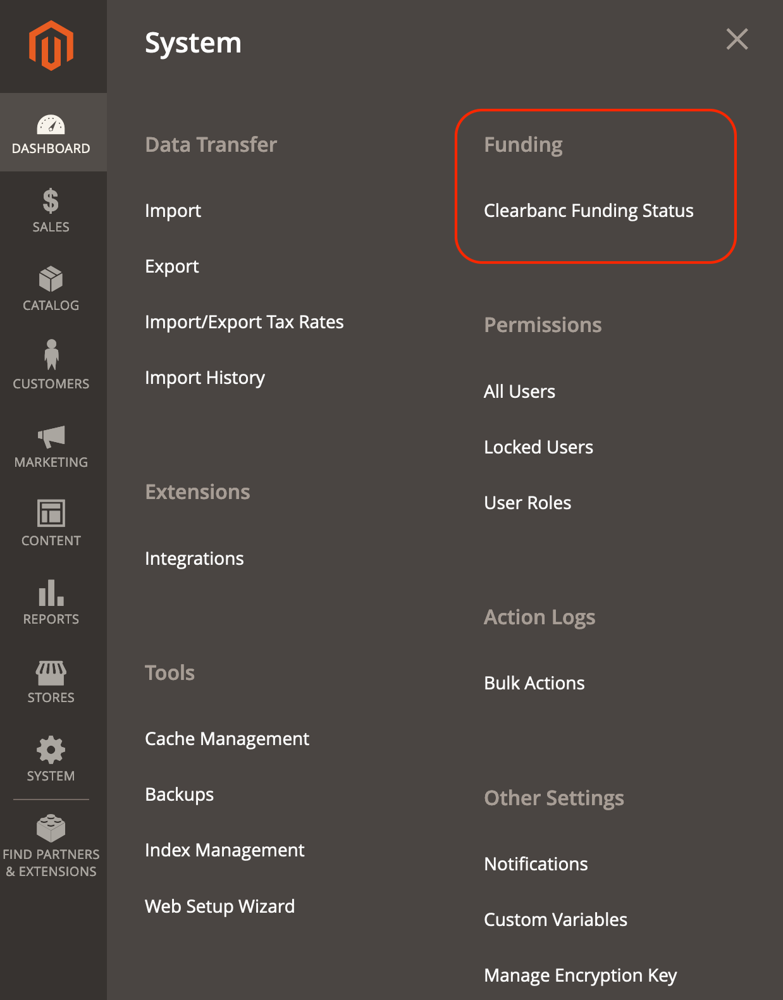
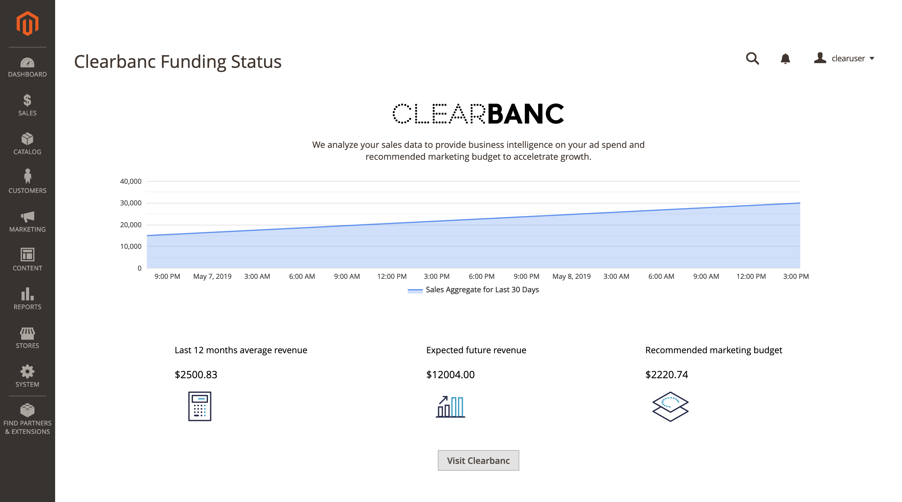
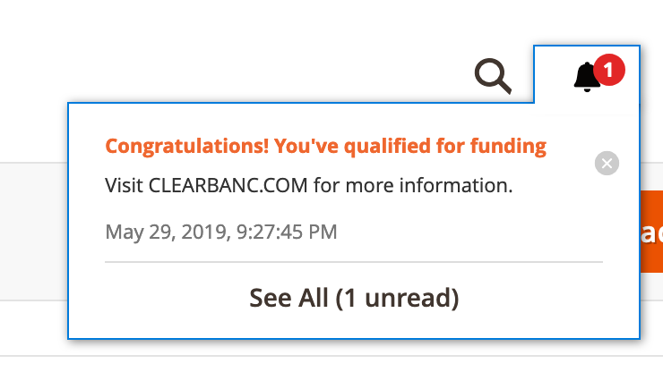

Clearbanc Funding Status extension for Magento v2
-------------------------------------------------


### Installation

You can install the Funding Status extension from [Magento Marketplace](https://marketplace.magento.com/) or manually via command line:

Use composer to fetch the package:
```bash
composer require clearbanc/funding-status-m2
```

Enable the extension:
```bash
bin/magento module:enable Clearbanc_FundingPage --clear-static-content
bin/magento setup:upgrade
bin/magento setup:di:compile
```

### Usage
After completing the installation, you can navigate to the extension  via `System -> Clearbanc Funding Status`.



This leads you to the Clearbanc extension which shows your sales aggregate for the last 30 days and some other useful statistics.



The extension logic will run calculations every couple weeks to decide whether you qualify for funding with Clearbanc based on your sales data.

You will receive a notification once you qualify.


